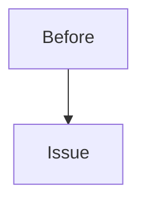
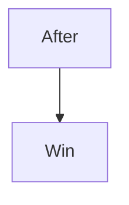

# obydul.me

Personal portfolio for Md Obydullah. Built with Next.js 16, multilingual (English / Arabic / Bengali), light + dark theme, fully static.

## Stack

- **Next.js 16** (App Router, Turbopack)
- **React 19**, TypeScript strict mode
- **Tailwind CSS v4** (`@theme inline` in `globals.css`)
- **next-intl v4** (i18n with locale-prefixed routes)
- **next-themes** (light/dark)
- **Mermaid** (rendered client-side in project + writing pages)
- **Radix primitives** + custom shadcn-style UI
- **DM Mono** + **Geist Sans** + **Outfit** + **Instrument Serif** + **Geist Mono**
- **Vercel** for deploy

## Quick start

```bash
npm install
npm run dev
```

Open <http://localhost:3000>.

## Scripts

| Command                | What it does                                           |
| ---------------------- | ------------------------------------------------------ |
| `npm run dev`          | Sync profile from career-hub, start dev server         |
| `npm run build`        | Sync profile, production build                         |
| `npm run start`        | Run production server                                  |
| `npm run sync-profile` | Copy `../career-hub/profile/*.md` → `content/profile/` |
| `npm run lint`         | ESLint                                                 |
| `npm run lint:fix`     | ESLint with auto-fix                                   |
| `npm run typecheck`    | `tsc --noEmit`                                         |
| `npm run format`       | Prettier write                                         |
| `npm run format:check` | Prettier check                                         |
| `npm run check`        | Typecheck + lint + format check (run before commit)    |

## Routes

```
/              Home (hero + featured projects + featured writing)
/projects      Project portfolio (list)
/projects/[slug]
/writing       Writing / war stories (list)
/writing/[slug]
/timeline      Career timeline
/resume        Structured CV with print/PDF support
/contact       Contact links
```

All routes are locale-prefixed via `next-intl`. Default `en` is shown without prefix; `/ar/...` (RTL) and `/bn/...` are explicit.

## Content sources

Three places where content lives:

### 1. Resume — `content/resume.ts`

Structured TypeScript export. Curated for the public CV. Edit `RESUME` to update name, summary, experience timeline, skills, education, languages, certifications, featured projects.

### 2. Projects — `content/projects/*.md`

Each markdown file is one portfolio item. Frontmatter:

```yaml
---
title: "Merchant Center Feeds Sync"
summary: "..."
year: "2024"
launch_date: "2024-01-01"
role: "Solo build"
status: "Live"
featured: true # opt in to home page
stack: ["Go", "AWS EKS"]
tags: ["backend", "go"]
github: "..."
live: "..."
---
```

Body is markdown. Supports `:::row` (2-column layout for diagrams), `:::stats` (3-column big-number card), and ` ```mermaid ` code fences.

Sort: by `launch_date` descending. Home page shows featured items first.

### 3. Writing — `content/writing/*.md`

War stories, hacking writeups, narrative pieces. Same markdown extensions as projects.

### 4. Profile (private prep) — synced from career-hub

`career-hub/profile/*.md` is the user's private prep doc. `scripts/sync-profile.mjs` copies it into `content/profile/` on every dev/build. Currently only the resume's structured-data version is rendered publicly; the markdown profile is no longer surfaced on any page (privacy default-on).

## Markdown extensions

Custom directives parsed by `src/lib/md.ts`:

````md
:::row





:::

:::stats

### 99.99%

fewer queries · 2M → 240

### 1000×

faster sync · 7d → 10m

### 10×

smaller image · 200MB → 20MB

:::
````

`:::row` renders 2-column on desktop, stacks on mobile. `:::stats` renders 3 big-number cards.

Mermaid diagrams render client-side via `MermaidProvider` and re-render on theme toggle.

## i18n

UI chrome only (nav labels, button text, section headings) is translated. Body content stays English.

```
src/i18n/messages/en.json
src/i18n/messages/ar.json   ← RTL
src/i18n/messages/bn.json
```

Keep keys parallel. RTL is handled by `<html dir>` in the locale layout. Use logical Tailwind utilities (`ms-`, `me-`, `ps-`, `pe-`) — never `ml-`/`mr-`.

## Theme

CSS variables in `src/app/globals.css` (`:root` + `.dark`). HSL channels. Toggled via `next-themes` adding `.dark` to `<html>`.

Tokens: `bg-background`, `text-foreground`, `border-border`, `bg-card`, `bg-muted`, `text-muted-foreground`, `text-accent`, `bg-accent`. All map to vars.

## Folder structure

```
src/
├── app/
│   ├── [locale]/        all routes (pages call setRequestLocale)
│   └── layout.tsx       pass-through; html lives in [locale]/layout.tsx
├── components/
│   ├── ui/              button, card, badge primitives
│   ├── icons/social.tsx GitHub / LinkedIn / X / WhatsApp SVGs
│   └── *.tsx            nav, footer, brand, theme-toggle, lang-switcher,
│                        hero-panel, mermaid-provider, print-button
├── i18n/
│   ├── routing.ts       locale list + RTL map
│   ├── request.ts       message loader
│   ├── navigation.ts    locale-aware Link / usePathname / useRouter
│   └── messages/
├── lib/
│   ├── projects.ts      project loader + sort + featured filter
│   ├── writing.ts       writing loader
│   ├── profile.ts       career-hub profile loader (sanitized)
│   ├── project-links.ts auto-link injector for resume bullets
│   ├── anonymize.ts     EF/project-name normalizer
│   ├── md.ts            tiny custom Markdown renderer
│   ├── site.ts          contact / domain / metadata
│   └── utils.ts         cn() helper
├── proxy.ts             next-intl proxy (replaces Next 15's middleware.ts)
content/
├── resume.ts            structured CV
├── projects/*.md        portfolio items
├── writing/*.md         writing
├── profile/*.md         synced from career-hub
└── timeline.ts          career timeline entries
scripts/
└── sync-profile.mjs     copies career-hub/profile → content/profile
```

## Deployment

Vercel. The `career-hub` sibling repo is **not** required at deploy time — `content/profile/` is committed as a snapshot.

## Conventions

See [CLAUDE.md](./CLAUDE.md) and [AGENTS.md](./AGENTS.md) for:

- Voice & copy rules (no em dashes, no marketing fluff)
- Privacy / sanitizer rules (no salary numbers, no internal company metrics)
- Commit message format (Conventional Commits)
- Next 16 quirks (`proxy.ts` not `middleware.ts`)
- RTL-safe Tailwind utilities
