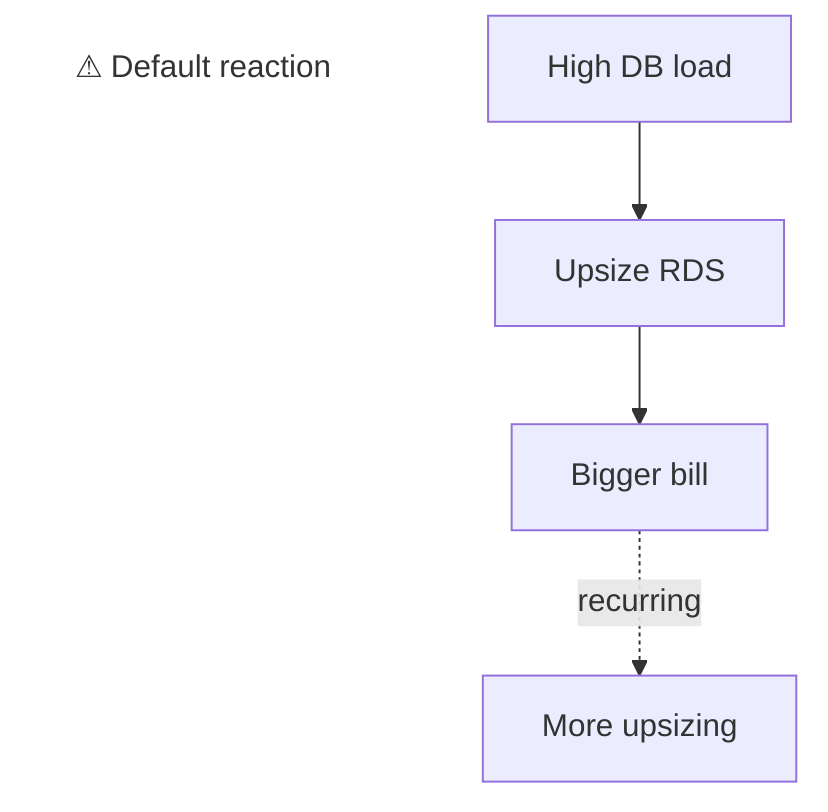
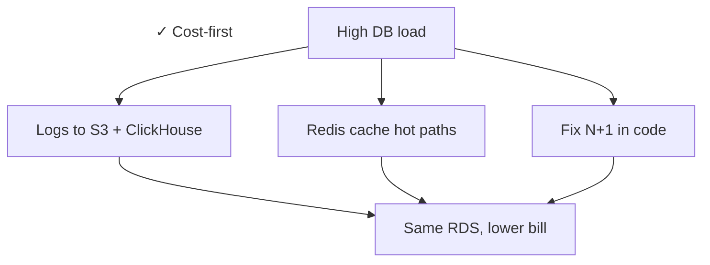

## Context

The platform isn't just the application. It's the cloud underneath. I've owned a production AWS environment end-to-end for 6+ years: architecture, deploys, cost, scaling, security.

## Scope

- **Application layer:** Laravel + NestJS + Next.js (see [E-commerce Platform Rebuild](/projects/ecommerce-rebuild))
- **Microservices on EKS:** the Go services (Merchant Center Feeds, Provider Price Sync, Product Feeds Generator) run here
- **Data:** RDS Multi-AZ writer + read replicas, RDS Proxy for connection pooling, ClickHouse for log/analytics offload
- **Edge:** Cloudflare in front, WAF tuned by hand, custom rules for bot defense
- **CI/CD:** GitHub Actions, ECR, Argo CD, Terraform for infra

## Cost-first mindset

The default reaction to load is to upsize. I prefer attacking the workload. A few examples:

- **Logs to S3 + ClickHouse** instead of bigger RDS storage
- **Redis cache for hot paths** to keep the DB out of the request loop where possible
- **N+1 fixes at code level** as the first lever, hardware as the last

## Security

- Defended the platform against multi-million-hit bot / DDoS attacks. Cloudflare WAF set up and tuned myself.
- Run my own pentests against the platform. Real findings: cart session hijacking, missing rate limits on forgot-password and DB-heavy endpoints. All fixed.
- CEH v12 course completed (EC-Council). Applied mindset, not just paper.

## Stack

AWS (EKS, RDS, S3, SQS, ECR), Cloudflare, Argo CD, Terraform, GitHub Actions.

## Outcome

Same scale, same reliability, smaller AWS bill. The default reaction to load is to upsize. I prefer attacking the workload first.

:::row

:::
