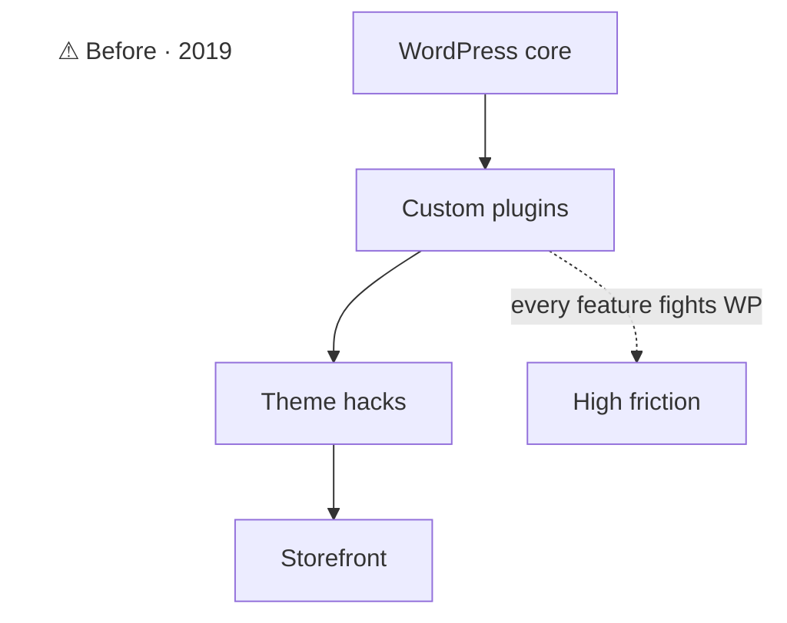
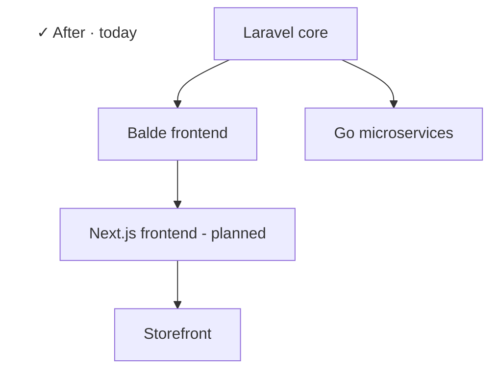

## Context

electronicfirst.com, a digital-goods e-commerce business, was running on WordPress in 2019. The platform had outgrown it: custom business logic was being shoehorned into plugins, performance was poor, and adding new features meant fighting WordPress instead of extending it.

## Problem

- WordPress wasn't built for the kind of e-commerce + digital-licensing flow needed
- Every new feature required either a custom plugin or theme hack
- No clean separation between content and business logic
- Couldn't run a real test suite, couldn't ship cleanly

## What I built

A full Laravel rebuild. Solo. Migrated incrementally.

### Approach

- **Parallel run:** kept WordPress live for ~1 year while Laravel grew. Routed traffic feature-by-feature.
- **Rewrote business logic in proper services**, not plugins
- **Today's stack** has evolved: Laravel + Go microservices.

### Stack

- Laravel (primary)
- Blade templates
- Go microservices
- AWS

## Outcome

The platform runs on this stack today. After the cutover I built and now lead the engineering team that maintains and extends it. The Go microservices listed elsewhere on this page (Merchant Center Feeds, Provider Price Sync, Product Feeds Generator) all plug into this platform.

:::row

:::
