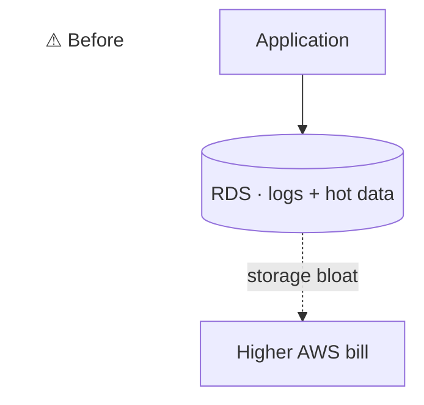
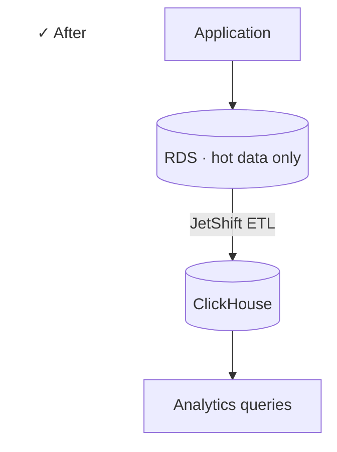

## Context

A platform I worked on had a cost problem with logs sitting on RDS. The fix was to offload to ClickHouse so the primary DB only carried hot data. The tool that moved the data became JetShift.

## Why open source

The internal use case was the trigger, but the ETL pattern is generic. Open-sourcing it gave back to the community and served as a public artifact of independent work outside the day job.

## Status

Not actively developed today. Lives on GitHub as a working tool. Listed here as part of the portfolio history rather than a current focus.

## Stack

- ClickHouse (target)
- RDS (source)
- ETL pipeline tooling

## Outcome

A usable ETL tool on GitHub for anyone hitting the same RDS-to-ClickHouse pattern.

:::row

:::
