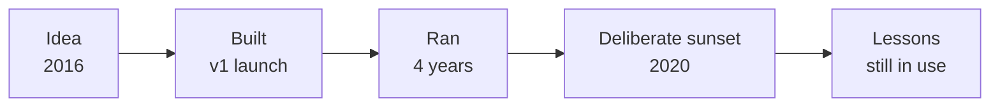

## Context

Bangladesh in 2016: finding a blood donor at short notice was a chain of phone calls and luck. Makpie was the attempt to fix that with a real search engine: filter by blood group, location, last-donation eligibility.

## What we did

Co-founded the company, built the product, ran it, learned where the model worked and where it didn't, and eventually shut it down deliberately rather than letting it rot.

## Why it's on this page

Founder experience matters. Not as a "I almost made it" story, but as evidence that I've owned a product end-to-end, including the unglamorous part of deciding to stop. That decision is harder than it looks and shapes how I think about scope, runway, and what's worth building today.

## Lifecycle

