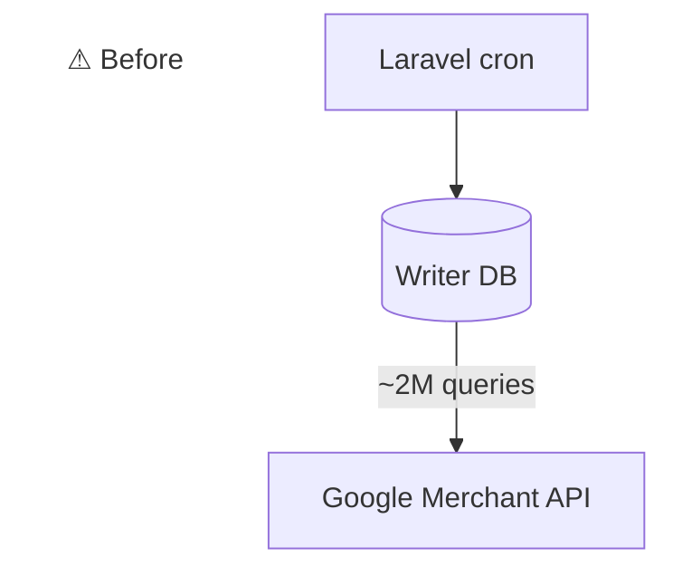
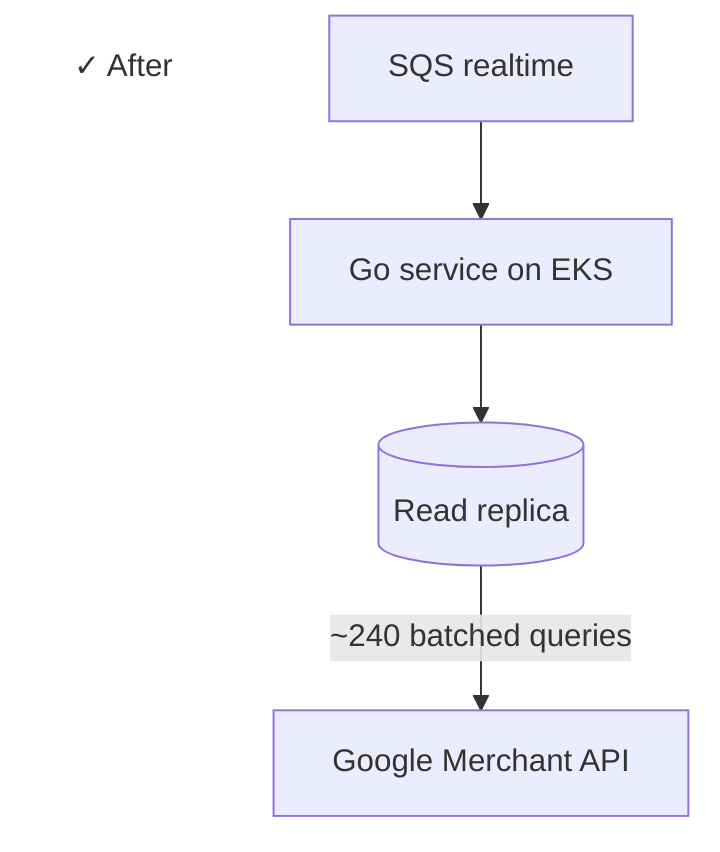
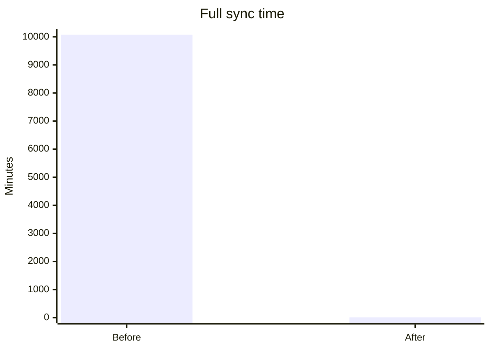

## Context

A digital-goods storefront with ~520K SKUs has to stay in sync with Google Merchant Center for paid traffic. The legacy pipeline was a Laravel cron hitting the writer DB with N+1 queries and taking days per full sync.

## Problem

- Full sync was running for a week and never finished cleanly
- Every run hammered the primary RDS writer
- No real-time updates. A price change on the storefront could wait days to reach Google.
- Laravel container image was ~200 MB, slow to roll

## What I built

A Go microservice on AWS EKS that owns the full sync lifecycle.

### Architecture

- **Read replica path:** all Merchant Center reads hit the read replica, not the writer
- **Batch queries:** rewrote the N+1 loop into ~240 batch queries per full sync
- **HTTP batching:** uses Google Merchant API multipart/mixed batching, 100 sub-requests per call
- **Real-time path:** SQS consumer with at-least-once delivery + DLQ for retry
- **Quota-aware scheduler:** 12-hour full sync + on-demand SQS, tuned to stay under Merchant API limits
- **Authenticated control API:** health, metrics, quota state, manual trigger

### Stack

- Go for the service
- AWS EKS for orchestration
- SQS for the event bus
- Distroless base image (~20 MB)
- GitHub Actions → ECR → EKS pipeline

## Outcome

The full sync that took a week now takes minutes. The writer DB is no longer in the path. Storefront price changes propagate to Google in seconds via SQS instead of waiting on the next cron tick.

:::row

:::

:::stats

### 99.99%

fewer queries · 2M → 240 per sync

### 1000×

faster full sync · 7 days → 10 min

### 10×

smaller image · 200MB → 20MB

:::
