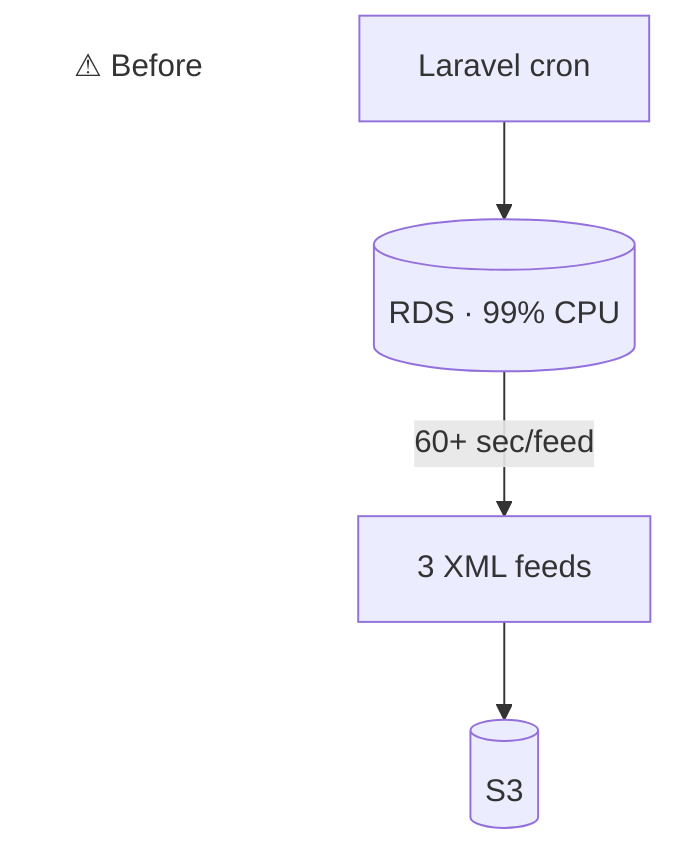
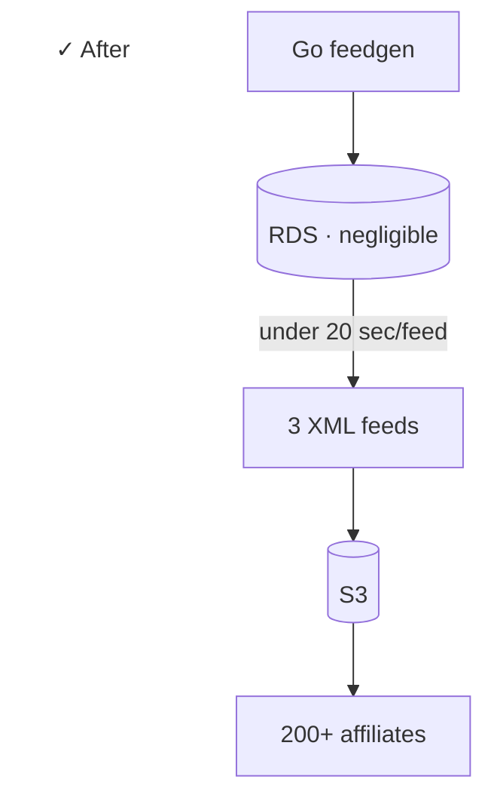

## Context

An affiliate program needs XML product feeds in 3 different formats (different currencies, schemas) covering a ~50K-product catalog, fresh every 10 minutes, available to 200+ affiliates via S3.

## Problem

The legacy Laravel feed job was generating each feed in 60+ seconds and pegging the RDS CPU at 99%. Affiliates were getting stale data, and the database was getting hammered every cron tick.

## What I built

A Go service that replaces the Laravel job entirely.

### Architecture

- **`feedgen` binary:** the generator. Pulls catalog data through optimized batch queries, writes 3 XML feeds, uploads to S3
- **`feedreader` binary:** companion utility for debugging. Ingests local or remote `.xml.gz` feeds from S3 or the CDN and re-exports as CSV for affiliate support tickets
- **Single repo, two binaries:** ships from the same Docker image
- **Branch-based CI:** `git push origin ecr` triggers build → ECR push

### Stack

- Go
- AWS S3 for distribution
- Docker, ECR
- Branch-based GitHub Actions deploy

## Outcome

Each feed now generates in under 20 seconds. RDS load went from 99% pegged to negligible. Affiliates get 10-minute-fresh data. The `feedreader` companion eliminated a class of "what's actually in this feed?" support tickets.

:::row

:::
