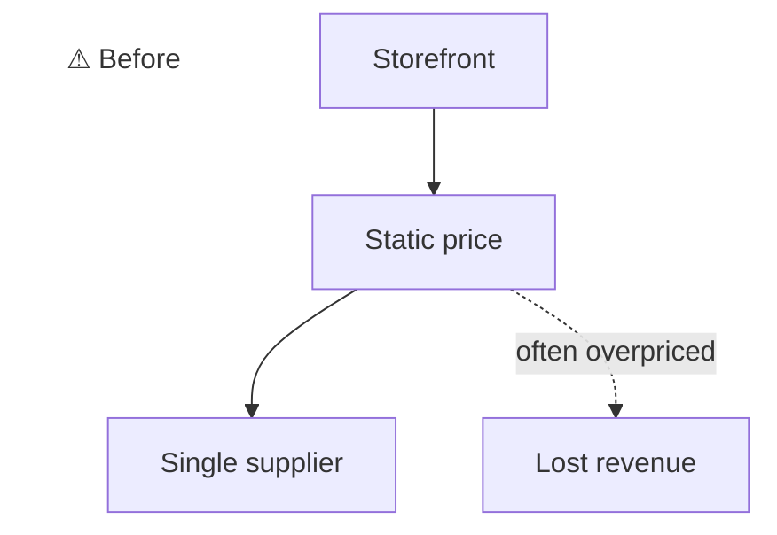
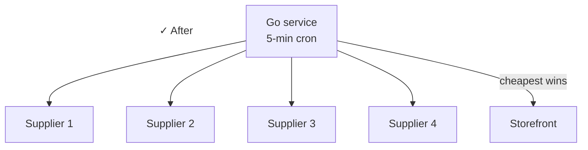

## Context

A digital-goods business sells products where a single SKU is often listed across 2–3 external supplier APIs. The storefront needs to always show the cheapest available price and route fulfillment to that supplier.

## Problem

- Multiple supplier APIs with different shapes, rate limits, and auth
- One supplier ships an encrypted CDN price file (not an API), needs decrypt + cache
- Need to run frequently without breaking when a supplier is down
- Operational controls had to live outside the binary so we could enable / disable / rollback fast

## What I built

A Go service deployed as Kubernetes CronJobs on EKS.

### Architecture

- **`price-checker` CronJob (every 5 min):** batches through the catalog, fetches live prices from each enabled provider per product, picks cheapest, pushes via webhook to the storefront
- **`encrypted-feed-sync` CronJob (every 30 min):** downloads a supplier's encrypted CDN price file, OpenSSL-decrypts it, caches as a fast binary `.gob`
- **Cursor-based batching:** stores `skip` in a `cron_job_settings` table; auto-resets at end of catalog. Runs are idempotent and resumable.
- **Operational controls:** `dry_run` mode, per-provider enable/disable via JSON `SERVICE_CONFIG` Secret, CLI/env provider filtering, single-product debug mode for testing in prod without side effects
- **Structured logging:** `log/slog` JSON to stdout, parsed by Grafana/Loki with per-field queries (price changes, batch completions, errors)

### Stack

- Go
- AWS EKS, K8s CronJobs (not system cron)
- OpenSSL for encrypted-feed decrypt
- Grafana + Loki for observability
- GitHub Actions → ECR → EKS

## Outcome

Customers always see the cheapest price across suppliers. New suppliers can be added without redeploying. Flip a flag in the K8s Secret. Single-product debug mode means I can verify a fix in prod without batching the whole catalog.

:::row

:::
