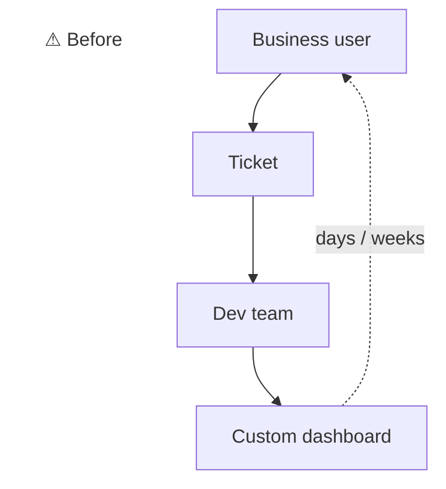
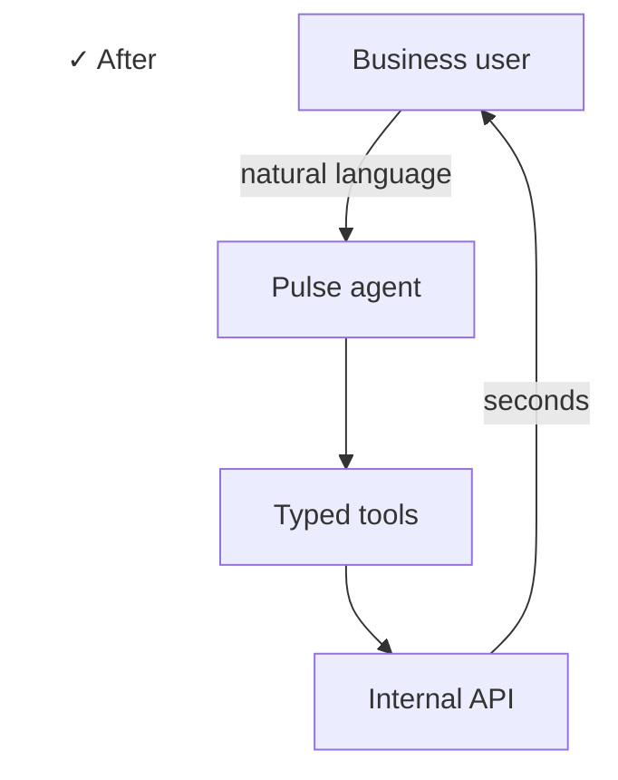

## Context

Business users (ops, marketing, support) needed live answers from internal data without filing a ticket or waiting for a dashboard build. Things like "tickets opened today", "top 5 products this week by revenue", "upsell performance last month".

## Problem

- A custom dashboard per question doesn't scale
- A SQL prompt-to-output toy isn't safe. Needs typed access, not raw queries.
- Users live in Discord, not in a custom UI
- Same questions need to work later in Telegram and WhatsApp without rewriting the agent

## What I built

A proper agent loop with typed tools, not a prompt-in / text-out wrapper.

### Architecture

- **Agent loop in `core/agent.ts`:** handles tool dispatch, conversation state, retries
- **Typed API client in `core/efApi.ts`:** every call typed end-to-end, no raw HTTP
- **Tools per capability:** each business question is a tool with a schema, parameters, and a typed return
- **Adapter layer:** Discord live today, Telegram + WhatsApp adapters planned. Same agent core, swap the I/O.
- **Slash commands:** structured escape hatch like `/orderstats`, `/productstats`, `/combostats` when natural-language is overkill
- **Multi-system integration:** checks supplier balances across 4 external APIs from the same bot. Real multi-system integration inside one agent.

### Stack

- TypeScript, Node 22+
- OpenAI tool-use API (function calling)
- Discord SDK
- Cleanly separated layout: `adapters / commands / core / tools / config` with per-tool docs

## Outcome

Business users now self-serve answers in Discord. The same agent core will ship to Telegram and WhatsApp without a rewrite. The "tools first, prompts second" architecture means we can audit and rate-limit at the tool boundary instead of trusting the LLM with raw access.

:::row

:::
