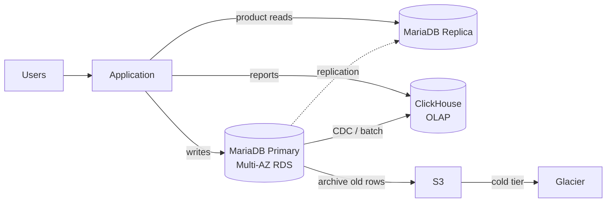

For the past few days, I have been feeling like writing down some memories from this small journey of my career. Sharing this as a memory. Insha’Allah, I will also share some of my recent experiences in the coming days.

Since 2016, I worked on many small and medium-sized projects on Fiverr, and later on Upwork. At that time, most of my work was focused on web and app development, along with bug fixing. I did not really get much opportunity to work deeply with databases.

Back then, I was still in university. I did not have enough time to take on large projects. Even before finishing university, I received job offers from a few good companies outside my country. Then, in May 2018, I joined Electronic First as a full-time engineer. I had been working there part-time since 2017.

After joining, I gradually started to understand how many different kinds of problems come up when working on large-scale projects. Real engineering challenges started appearing from that point.

## When data became the problem

Around the middle of 2020, I started thinking seriously about data. New data was being added to the database every single day, and all of it was very important, especially transaction data.

As the data kept growing, query time also started increasing. This was an eCommerce website where we had to generate different kinds of reports. It was not only the reports, even normal product queries and other complex queries were taking much longer.

The stack at that point: MariaDB 10.5 on Amazon RDS, `db.t3.medium`. The transaction database had crossed 4 GB and the slower reports were running at around 6 seconds.

That was the point where my interest in databases really started.

## Learning alone

My resources were blogs, YouTube, Google, and Stack Overflow. I was not active in the local IT community, so no senior database people in my network. I figured it out on my own.

That was when I first became familiar with concepts like indexing and normalization, although I could not fully understand them in the beginning. Because of other work responsibilities, I could not dedicate enough time to databases. But the reporting issue kept bothering me the most.

On September 30, 2021, I made a post in the Talk.js Facebook group laying out the setup and asking the community how to scale queries as data grew. Many senior professionals left very informative comments. Their insights helped me a lot. Even then, I was still unable to make the reporting fast enough.

I kept hitting the ceiling of what indexing alone could do. Started reading about how analytics is actually built at scale. Reports were slow but still workable. I had a plan forming, not yet shipped.

## Finding OLAP

Then reports started timing out at the **1-minute** mark. The thinking phase was over.

By then the research had pointed me to Amazon Redshift and ClickHouse over and over. The conclusion was the same in every direction: no matter how much I optimized, generating reports directly from the application database was the wrong approach. That was when OLAP and analytical databases finally clicked for me as a concept.

I set up ClickHouse for our project. Reports that had been hitting the 1-minute timeout started returning in **5 to 10 seconds**. Load on the main application database dropped at the same time.

## What changed after

OLAP was the start, not the end. As the project kept growing, I rolled out the rest of the scaling pieces one at a time.

- **Multi-AZ RDS.** Replaced the home-grown 30-minute backup script (the one mentioned in the FB post) with proper Multi-AZ replication. Failover and backups handled by AWS, not by a cron job I had to babysit.
- **Read replicas.** Split reads from writes. Heavy product queries and dashboards went to the replica. Transactional writes stayed on the primary.
- **ClickHouse for reports.** Analytics had no business running on the OLTP database anymore.
- **Cold storage tiering.** Old transactions and logs moved to S3, then to Glacier once they were rarely touched. Hot tables stayed small and fast.
- **Sharding** for the largest datasets.

The final shape, in one picture:

End result: pages loaded faster, reports ran faster, on-call paged less, and storage costs stopped growing in lockstep with the data.

## Looking back

Even though I had been working for clients since 2016, it still took me several years to gain a clear understanding of reporting databases and data warehousing.

Today, we use ClickHouse in production for reporting, write complex queries, and now AI has made query drafting much easier as well.

The lesson stuck. Pick the right database for the workload. The application database is for transactions. Reports belong somewhere built for them.
